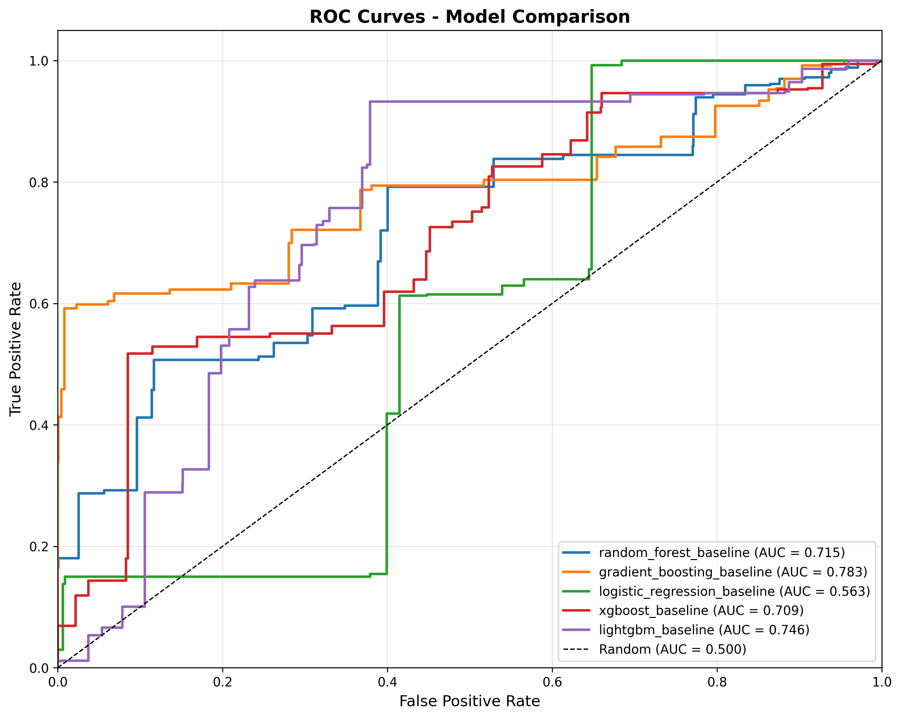
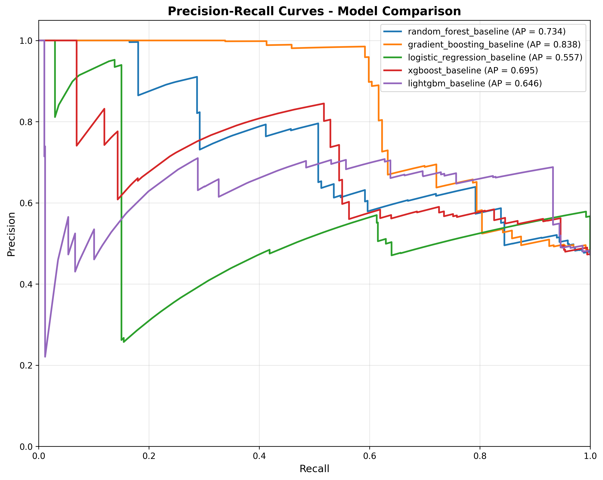
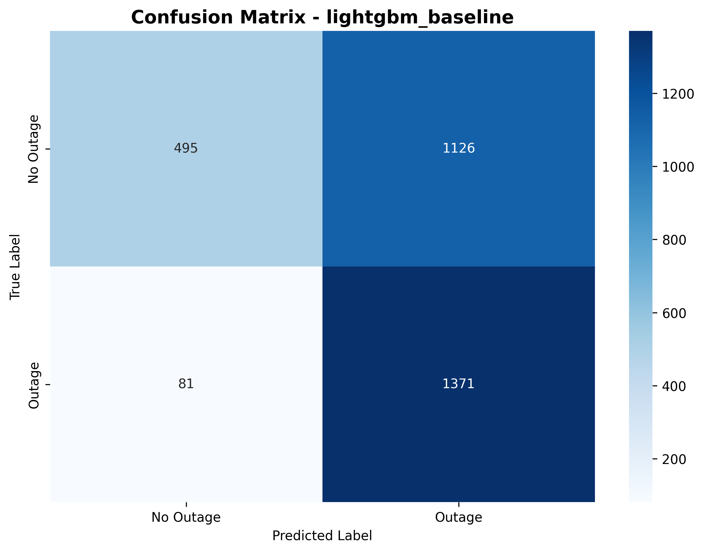
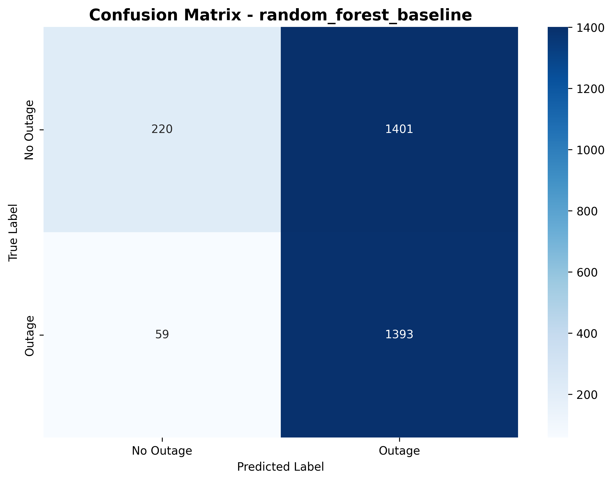
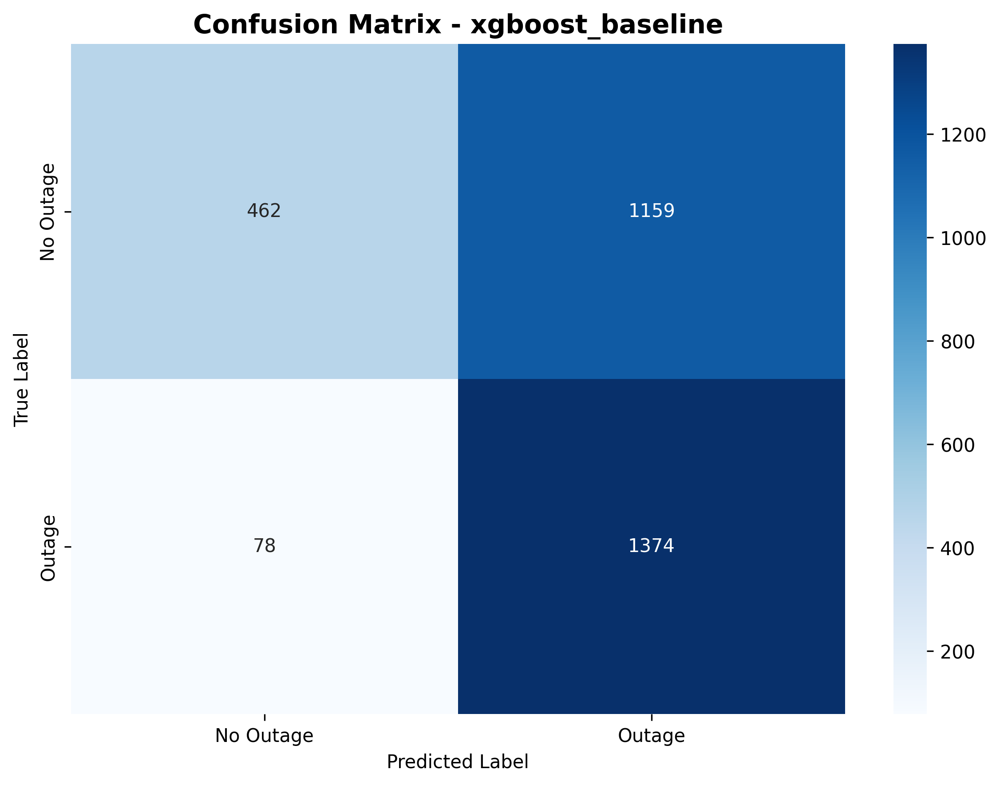
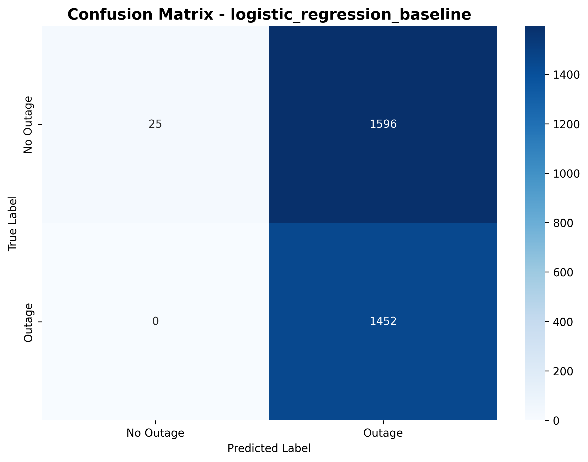

# Model Evaluation Report

**Generated**: 2025-11-01 00:58:03

## Model Comparison

| Model                        |   Accuracy |   Precision |   Recall |   F1 Score |   ROC-AUC |   Avg Precision |
|:-----------------------------|-----------:|------------:|---------:|-----------:|----------:|----------------:|
| gradient_boosting_baseline   |   0.520013 |    0.495513 | 0.874656 |   0.632628 |  0.783004 |        0.837935 |
| lightgbm_baseline            |   0.607224 |    0.549059 | 0.944215 |   0.694353 |  0.745843 |        0.646183 |
| random_forest_baseline       |   0.524894 |    0.498568 | 0.959366 |   0.656147 |  0.715331 |        0.733779 |
| xgboost_baseline             |   0.597462 |    0.54244  | 0.946281 |   0.689586 |  0.708976 |        0.695244 |
| logistic_regression_baseline |   0.480638 |    0.476378 | 1        |   0.645333 |  0.563484 |        0.556655 |

## Best Model

**Model**: gradient_boosting_baseline

- **Accuracy**: 0.5200
- **Precision**: 0.4955
- **Recall**: 0.8747
- **F1 Score**: 0.6326
- **ROC-AUC**: 0.7830

## Visualizations

### ROC Curves

### Precision-Recall Curves

### gradient_boosting_baseline - Confusion Matrix

### lightgbm_baseline - Confusion Matrix

### random_forest_baseline - Confusion Matrix

### xgboost_baseline - Confusion Matrix

### logistic_regression_baseline - Confusion Matrix

